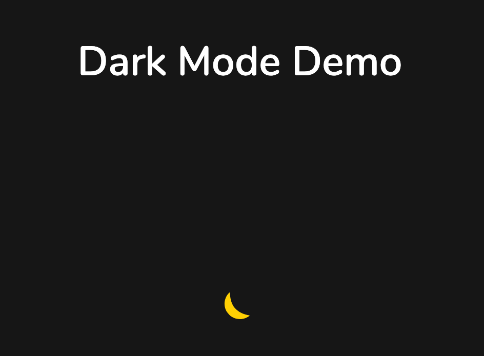
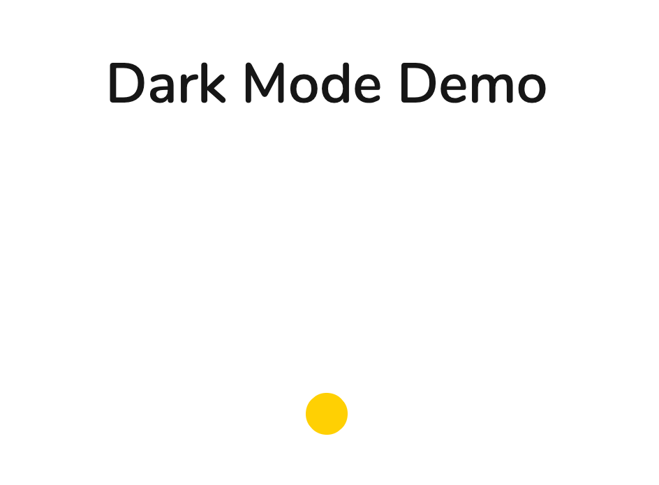

# Javascript-Animation-DarkMode
Tiny Animation in Javascript using 🔥 Animate.js to change Page mode to Day or Night. Now you can imagine how can you scale this to your entire App. Happy Javascript Animation  😎  😎 

## Demo
Checkout [Demo here](https://arifshariati.github.io/Javascript-Animation-DarkMode/)
## Screenshot

